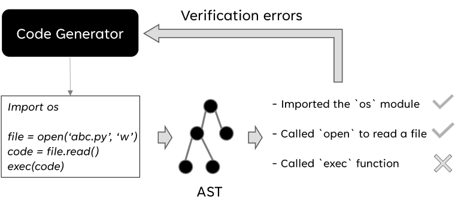

# Code Verification

## Why do we need code verification?
Agent developers may want to verify the generated code before running it.
In the following example shown in the figure, the generated code is 
```python
import os

file = open("abc.py", "r")
code = file.read()
exec(code)
```




In this case, the generated code read the content of a file and execute it, which is potentially dangerous.
To prevent this, we can use code verification to check the generated code before running it.
If the code does not pass the verification, the errors will be reported to the CodeGenerator to re-generate the code.

## How to use code verification?
To use code verification, you can add the configuration `"code_interpreter.code_verification_on": true`
in the project configuration file `taskweaver_config.json`.
Then, the generated code will be verified before running it.

After enabling code verification, you can also specify the code verification rules in the project configuration file.

| Parameter	                          | Description	                                              | Default                                                                                                                                    |
|-------------------------------------|-----------------------------------------------------------|--------------------------------------------------------------------------------------------------------------------------------------------|
| code_interpreter.allowed_modules	   | The list of allowed modules to import in code generation. | 	["pandas", "matplotlib", "numpy", "sklearn", "scipy", "seaborn", "datetime", "typing"], if the list is empty, no modules would be allowed |
| code_interpreter.blocked_functions	 | The list of functions to block from code generation.      | 	["_\_import__","eval", "exec", "execfile", "compile", "open", "input", "raw_input", "reload"]                                             |

We currently support checking the allowed modules and blocked functions.
If a module is in the `allowed_modules` list, it can be imported in the generated code.
If a function is in the `blocked_functions` list, it cannot be used in the generated code.

## How is code verification implemented?
The code verification is implemented in two parts.
First, we add instructions to CodeGenerator's prompt, so it generates code following the required rules.
For example, if we don't want the generated code to import the `os` module, 
we will add an instruction to the prompt to tell CodeGenerator not to import the `os` module.

Second, we conduct a static analysis on the generated code to check if it follows the required rules.
The code is parsed into an AST (Abstract Syntax Tree) and we check if the AST  
only imports the allowed modules, and does not use the blocked functions.
The implementation of the static analysis can be found in `taskweaver/code_interpreter/code_verification.py`.

